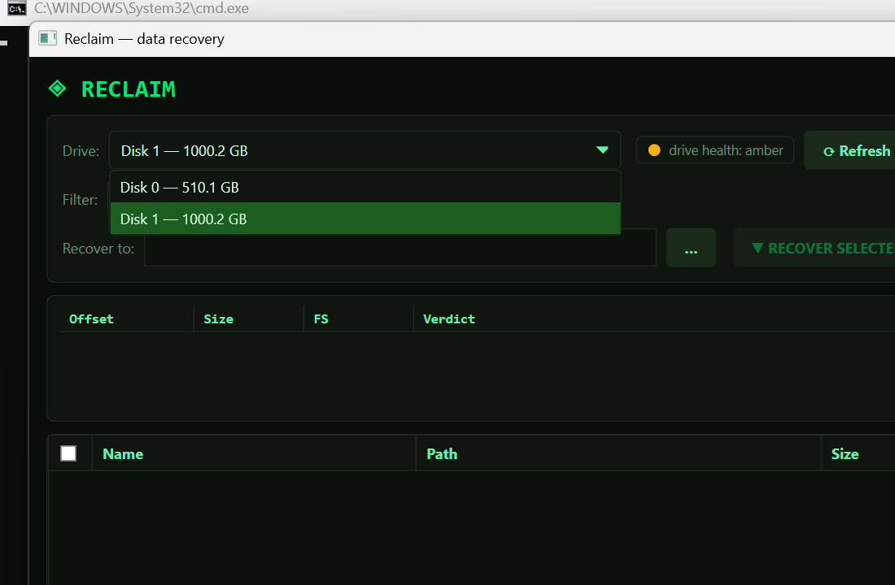

# Reclaim

Read-only disk & data recovery for Windows. Recovers files from drives
Windows can't (or shouldn't) mount — missing partition tables, wiped boot
sectors, deleted files — while narrating *what* it found and *why* it's
using a given recovery path.

Built for a real case: a 1 TB SSD whose first ~1 GB was wiped by a drive
test. Windows asked to "initialize" it (don't — that writes over your data).
Reclaim located the surviving NTFS MFT and rebuilt **1.16 M records /
204 K deleted files** in ~35 seconds.



## Download

Grab `Reclaim.exe` from
[Releases](https://github.com/gcnewbief/Reclaim/releases) — a single
self-contained exe (~69 MB). No .NET install, no installer. It must run
**as Administrator** (raw disk access requires it); Windows will prompt.

## How it works

Scanning is tiered — the app picks the cheapest tier that can work:

| Tier | Trigger | Speed |
|------|---------|-------|
| **Triage** | Always — parses MBR/GPT, probes each partition's boot sector, explains *why* Windows can't mount the disk | seconds |
| **Quick scan** | Healthy NTFS boot sector found — walks `$MFT` directly | seconds |
| **Smart scan** | Boot sector gone — hunts raw `FILE` records until the MFT self-locates, then reads its extents directly | ~30 s |
| **Deep scan** | `DEEP SCAN ONLY` button — every-sector record hunt + signature carving | minutes–hours |

What you get back:

- **Full file tree** — names, folders, sizes, timestamps from MFT records
- **Deleted vs live** state, and a **recoverability health** grade per file
  (Good/Partial/Poor from `$Bitmap` cluster analysis — tells you whether
  the file's data still sits in unallocated space)
- **Resident files** recovered straight from the MFT record; **non-resident
  files** (films, photos, archives) followed via data run lists
- **Signature carving** when metadata is gone entirely — MKV/MP4/AVI/WMV/TS,
  JPEG/PNG/GIF, ZIP/PDF/DOCX, and more
- **Drive health** — traffic-light indicator plus a full SMART attribute
  report (ATA pass-through, with storage-counter fallback for NVMe/USB)
- **Diagnostic log** — every decision narrated: "no partition table →
  Tier 2", "bitmap: 15.5% clusters free", per-region read failures

## Using it

1. Select the damaged drive — the health light reads SMART automatically
2. **SCAN** — watch the log narrate triage → tier selection → results
3. Filter (`*.mkv`, `*\DCIM*`, …), tick files with the checkboxes
   (header box = check everything shown)
4. **Recover to:** pick a folder on a **different physical drive**
5. **RECOVER SELECTED**

## Safety

- **Read-only against the source.** Scanning and recovering never write to
  the disk being recovered — that's the whole point.
- **The app refuses** an output folder on the same physical disk.
- **Never "initialize" a damaged drive** when Windows asks — that writes a
  new partition table over recoverable data. Scan it first.
- Recovery is best-effort: overwritten clusters are gone, and nothing can
  bring them back. If the data matters, stop using the drive *now*.

## Build from source

Requires a Windows .NET SDK (project targets `net10.0-windows`):

```
dotnet publish -c Release -o publish
```

Produces a self-contained single-file exe — runtime embedded, portable to
any Windows machine. Test harnesses: `cli/` (headless engine test) and
`uitest/` (FlaUI UI automation) — both need elevation.

## Disclaimer

This software is provided **as-is, without warranty of any kind** (see
LICENSE). Data recovery touches raw disk structures; while this tool is
deliberately read-only on the source drive, **you use it entirely at your
own risk**. Always verify recovered files and keep the source disk
untouched until recovery is confirmed complete.

## License

MIT — free for any use, at your own risk. See [LICENSE](LICENSE).
